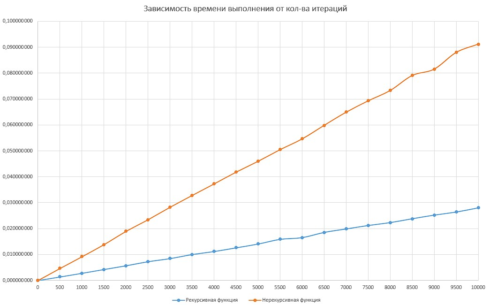

# Отчёт #
1. Доработана рекурсивная функция по построению бинарного дерева
2. Реализована нерекурсивная функция
3. Реализованы тесты функций
4. Проведено сравнение функций

# Сравнение реализации рекурсивной и нерекурсивной функции #
Реализован алгоритм измерения времени выполнения рекурсивной и нерекурсивной функций и записи результатов в лог-файл

# Вывод #
Из графика зависимости видно, что рекурсивная функция эффективнее нерекурсивной.
Наилучший результат был достигнут при количестве итераций менее 500.